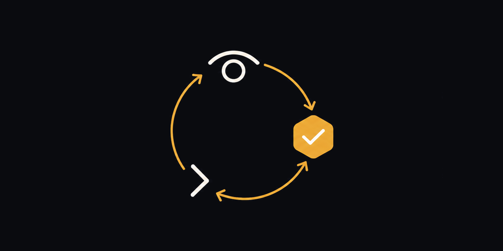
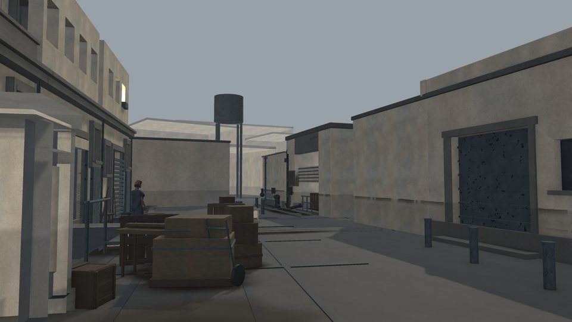
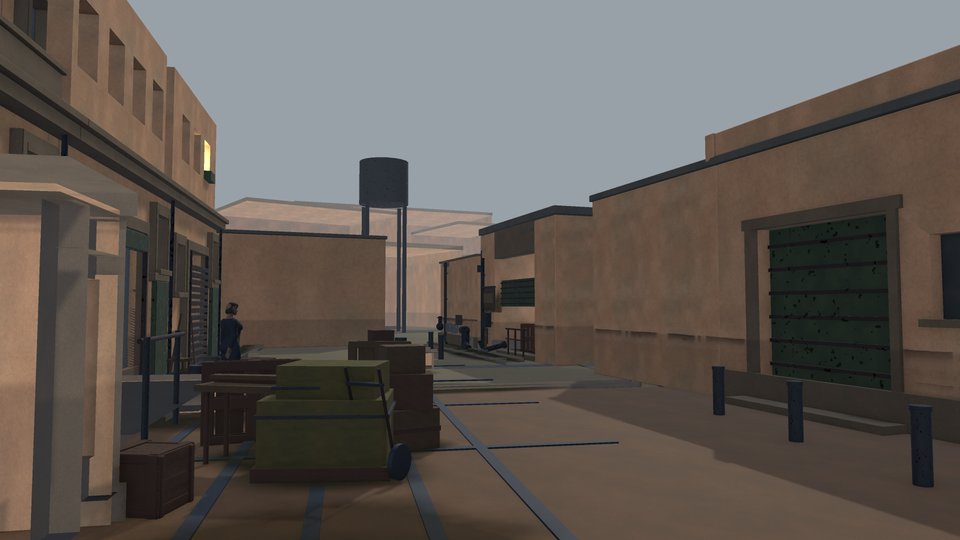

<p align="center">
  
</p>

<h1 align="center">Orchestrator</h1>

<p align="center"><b>A judge decides, an agent executes, proof settles it.</b></p>

<p align="center">
  
  
  
</p>

An orchestration loop for coding agents. It removes the copy-pasting between the
conversation where you think — with a model that judges the work — and the
harnesses that actually touch the repository. It reads the instruction, runs it,
derives cost and deliverables from the traces, attaches the renders, and posts
the report back. The judge accepts or rejects, and the loop carries on.

And it **refuses to close an objective until its proof is in.**

## Proof, not opinion

| | |
|---|---|
|  |  |
| `saturation 0.128 · 2 hues · 48 distinct colours` | `saturation 0.216 · 8 hues · 220 distinct colours` |

Those lines are not captions. They are what a command printed, and the objective
they belong to closed because it printed them:

```bash
orchestrator visual docs/after.png --min-saturation 0.20 --min-hues 7   # exit 0
```

A criterion names what will read it — a command, a value, a count, a threshold —
and the exit code decides. Any command does: your tests, your linter, a script
you wrote this morning. `orchestrator visual` is simply the one that comes with
it, for work whose result is an image.

What a criterion may **not** be is a score to reach. A number no command computes
cannot be satisfied by any single deliverable, cannot say which part of it failed,
and gets announced by the session doing the work — which is recorded as
inconclusive, so the objective never concludes however long it runs.

It is meant to run unattended. The browser it drives is started, reopened and
reloaded by the loop itself; a conversation that fills up is replaced without
anyone being asked; work is queued from the screen rather than typed into a
terminal. What stays yours is what genuinely is a decision: signing in,
installing a harness, and saying whether a criterion is met.

## The idea

"Done" is not a field an agent writes, it is a **condition you evaluate**. An
objective closes only if:

- its proof criterion is written down — without one, nobody may claim it;
- its sub-objectives are closed — a chapter never closes before its parts;
- a `pass` proof exists, and **an image if the criterion is about seeing**;
- a high blast radius has been answered with real-world proof, not a green build;
- the project's judge has ruled — and a rejection **revokes** its earlier approval;
- no halt that requires a human is still open.

Everything else is **derived, never declared**: cost comes from the transcripts,
deliverables from the files actually written during the session, liveness from an
attempt that has no end. An agent cannot forget to report what is read on its
behalf — and cannot award itself a success.

## Getting started

```bash
npx @chaibialaa/orchestrator@beta serve     # http://localhost:4747
```

The interface ships built inside the package — nothing to compile. `orchestrator`
is the command name; the scope is only there because the bare name was already
taken on npm.

To work on the tool itself, run it from source instead:

```bash
git clone https://github.com/chaibialaa/orchestrator.git
cd orchestrator
npm install            # the server
npm --prefix web i     # the interface
npm run build          # builds the interface into public/
npm start              # http://localhost:4747
```

One process serves the interface **and** the API. Data lives in a SQLite file
under `~/.orchestrator/` — no database to install, and a backup is a copy of that
file; `orchestrator where` tells you which one.

On a first run the interface opens a walkthrough at `/setup`. It measures rather
than asks: where each harness actually is on this machine, whether the browser is
reachable, whether it is **signed in** — asked of the page, since a tab parked on
a login screen satisfies "a tab exists" perfectly. What is missing is followed by
the one command that changes it.

Then, in every repository you drive, leave a worker running:

```bash
cd my-project
orchestrator work --every 5
```

The server records what you ask for; the worker on the machine that holds the
repository claims it and carries it out. That separation is deliberate: a server
able to run commands on your machine would be a far worse thing to expose. It
also means the interface can replace the terminal — start a chapter, stop it,
carry on turn by turn, put an urgent command in front of the queue.

## Declaring a project

In the root of **every repository you drive**, an `.orchestrator.json` declares
what is local to this machine. The server itself never stores a command to run:
that separation is what will make it safe to host without it being able to
execute anything on anyone's machine.

```json
{
  "project": "my-project",
  "blastRadius": ["src/payments/**", "migrations/*"],
  "proofs": {
    "build": "npm run build",
    "test": "npm test -- --run"
  },
  "probes": {
    "migrations_touched": "git status --porcelain -- migrations | grep -c . || true"
  },
  "branch": "orchestrator/{id}-{slug}",
  "teardown": {
    "rented_gpu": "…terminate the pod…",
    "editor_play_mode": "…leave play mode…"
  },
  "binaries": { "codex": "/path/to/codex" },
  "env": { "NODE_ENV": "test" },
  "secrets": { "RUNPOD_API_KEY": "" }
}
```

| key | what it decides |
| --- | --- |
| `project` | which server-side project this repository belongs to |
| `blastRadius` | the sensitive paths: touching them demands real-world proof |
| `proofs` | the **only** commands that may ever run — nothing else is executable |
| `probes` | diagnostic readings, attached to the report |
| `branch` | which branch a pass works on. Unset — the default — means the one you are on, exactly as before. A template like `orchestrator/{id}-{slug}` gives one branch per objective, created if absent; a plain name puts everything on that branch. It REFUSES rather than forces: a working tree with uncommitted changes keeps the branch it is on and says so, because switching under uncommitted work is how work disappears |
| `teardown` | a safety net for what a pass could not close itself — see below. Runs after **every** pass whatever its verdict, with the session's own environment and secrets, and never throws |
| `binaries` | where to find a harness; `ORCHESTRATOR_CODEX_BIN` wins, otherwise the PATH decides |
| `env`, `secrets` | what gets injected into the agent's environment (an empty secret overrides nothing) |
| `deliverableDirs`, `deliverableIgnore` | narrow the deliverable sweep when the default is not enough |
| `sessionTimeoutMin` | how long one pass may run before it is cut off. Unset means no limit. It is the only bound that binds: a turn is not a request, and neither is a token |
| `harnessModel` | model handed to the harness, when the default is not the right trade. Unset by default: mechanical work is cheaper elsewhere, but a chapter is usually not the place to save |

This file holds machine paths and keys, so it is **git-ignored** — keep it local.

### Handing the keys back

A session rents a machine, starts a remote job, leaves an editor in play mode.
Nobody can write that shutdown command ahead of time — a pod's identifier does
not exist until the pass creates it — so the order to close travels **with the
mission**: every instruction handed to a harness ends with a request to shut down
whatever it started and say what it shut down. The thing that opened it is the
only thing that knows what it opened.

That covers a pass that finishes. It cannot cover one that dies before reading
the line — a crash, a usage ceiling, a timeout — which is what `teardown` in
`.orchestrator.json` is for: it runs whatever the verdict, and what it could not
close is filed as a failing proof, visible on a screen rather than discovered on
a bill.

### What an agent is allowed to do

Per project and per harness, on the **What it may do** screen. It matters more
than it looks: Claude is handed this list as `--allowed-tools`, so a session
running with nobody at the screen cannot ask for anything — whatever is not on
the list is refused, silently, and the pass bills for the refusal. Codex is
launched with approvals and sandbox bypassed and is never handed the list at all;
its rules there are documentation, not a barrier. Only the repository can bind it
— a `pre-push` hook stops a push whatever the harness.

The trap is a criterion that names a command the executing session may not run.
If the criterion says `orchestrator visual` and `Bash(node …/cli.js *)` is not
on the list, the command never runs and the objective cannot conclude, however
long it runs. Rules arrive on their own when a session
asks for one — and you can type one in directly, which is the only way in for a
tool nobody has been able to ask for yet.

## The loop

```bash
cd my-project
orchestrator chapter --objective 42 --budget 60 --max-turns 8 --post
```

`--post` commands **execution as well as writing**: without it the loop reads and
runs nothing. And the guardrail that matters is not the budget but
`--budget-sans-progres` (40 $ by default): what you tolerate spending without a
single objective being proven. Neither dollars nor turns measure progress; that
one does.

A loop started in the background of a terminal dies with it. Detach it:

```bash
nohup orchestrator chapter --objective 42 --budget 60 --post \
  > chapter-42.log 2>&1 < /dev/null & disown
```

Or start it from the screen and let the worker carry it — same run, visible
turn by turn, stoppable without a terminal.

Two passes are never allowed to share a working tree by accident: a second one on
the same repository is refused, and names the run that holds it. You can queue it
alongside on purpose, and the mission then opens with who else is in the
checkout and what not to touch.

### A way back

Before a pass runs, everything uncommitted is captured into a commit object that
touches neither the working tree nor any branch — `git stash create`, kept alive
under `refs/orchestrator/`. At an accepted verdict, the work is committed for
real: that is the one moment the tree is known good, proved and judged. Never
pushed — publishing is a decision.

Both are silent where they cannot work. No git repository, or no configured
identity, and nothing happens: your project may have neither, and a loop that
fell over on an unset `user.email` would be failing at the wrong thing.

The hole, stated because a net that hides one is worse than no net: files git
does not track are not covered.

### Keeping it running, and stopping it

`nohup … & disown` survives a closed terminal and nothing else. A reboot, a
crash or a closed laptop ends the loop, and the only sign is that nothing ran
overnight.

```bash
orchestrator service --repo /path/to/a/repository
```

writes two launchd agents — the server, and a worker in that repository — which
come back when they exit and start again at login. It only WRITES them: loading
a background service on your machine is your decision, and the command to take
it is printed. `launchctl bootout gui/$(id -u)/io.orchestrator.server` removes
one for good.

**This command is macOS-only for now** — it is the one part that is. Everything
else runs wherever Node does; on Linux or Windows, write the equivalent unit
yourself (systemd `--user`, Task Scheduler) around the same two commands,
`orchestrator serve` and `orchestrator work --every 5`. Two other spots still
assume a Mac and will need the same treatment: finding a running Unity editor
(`pgrep -f Unity.app/…`) and the Chrome binary the judge is read through.

Stopping a single pass is different and does not need any of that: ask it to
stop, from the screen or `POST /runs/:id/cancel`. The worker sees the flag
between two turns and finishes the one it is in — killing a session mid-flight
throws away work that has already been paid for.

Three failures the loop handles without help: the usage ceiling (it waits and
probes rather than giving up), the API going away (it keeps polling, and says so
after the first minute instead of going quiet), and a harness or browser that
stops answering — see below.

### What it repairs on its own

- **No browser.** It starts Chrome on its own profile — never the one you browse
  with — and waits for it to answer.
- **A closed tab.** It reopens the conversation the project drives.
- **A wedged page.** Asking again more politely does not unwedge a renderer, so
  it reloads and waits for the messages to be drawn back.
- **A conversation that has filled up.** Every turn re-reads the whole thread, so
  a long one gets slower, dearer and worse at remembering its own rules. Past its
  cap the loop opens a fresh conversation, posts the state into it, keeps the new
  address, and carries on.

### What goes in, what comes out

Renders, JSON and markdown produced by a pass are attached to the judging
conversation automatically. The other way works too: attach a mock-up to match, a
screenshot of what broke, a spec. It lands in the tool's own directory — never in
the repository, where it would become a change to review — and every session is
told the files exist and where to open them.

Proofs are also pushed to a shared storage as they are produced, so a teammate
reads them without cloning anything. Everyone connects their own account.

## Commands

```
orchestrator serve            the interface and the API
orchestrator work --every 5   carry out what the interface asked for, here
orchestrator chapter          the loop: judge, execute, prove, report
orchestrator plan --watch     break a free-form brief into provable steps
orchestrator judge:renew      open a fresh driving conversation and hand it the state
orchestrator do <harness>     a single instruction, outside the loop (--probe: no objective)
orchestrator agents:check     establish what is reachable on this machine
orchestrator inventory        what the repository actually contains
orchestrator prove <id> <key> run a declared proof and file it as evidence
orchestrator visual      measure a rendering — palette, value range, and
                              where the dark and the light sit; any --min-… or
                              --max-… turns a reading into a pass or fail
orchestrator import <json>    restore an export
orchestrator where            where the database lives
```

`orchestrator` with no argument lists everything else.

## `orchestrator visual` — reference

```
orchestrator visual <image.png> [--json] [--ref target.png]
    [--min-saturation X] [--min-hues N] [--min-colours N]
    [--min-contrast X] [--min-shadow X] [--min-highlight X]
    [--tension-ref same-camera.png]
    [--min-tile-dark-std X]              [--max-tile-dark-std X]
    [--min-brightest-tile-ratio X]       [--max-brightest-tile-ratio X]
    [--min-delta-tile-dark-std X]        [--max-delta-tile-dark-std X]
    [--min-delta-brightest-tile-ratio X] [--max-delta-brightest-tile-ratio X]
```

The image is resampled to 96 × 96 by `sips` before anything is counted: what is
measured is composition, not compression artefacts. The last line of stdout is
always the measurement as JSON, on the passing path and on the failing one, so a
gate reads the line and a person reads the block above it.

**Exit codes.** `0` when every threshold that was set is met, `1` when at least
one is not, and `1` with a usage message on stderr when the command itself is
wrong — an unreadable reference, a flag with no number, a delta threshold with
nothing to compare. A threshold nobody set is not a threshold that failed.

### The six palette and value measures

| Key | What it is |
|---|---|
| `saturation` | mean HSV saturation |
| `hues` | how many of 24 hue buckets hold more than 0.5 % of the pixels |
| `distinctColours` | distinct colours, quantised to 5 bits a channel |
| `contrast` | p95 − p5 of value: how far the image travels end to end |
| `shadowShare` | share of pixels with `v < 0.15` |
| `highlightShare` | share of pixels with `v > 0.85` |

Throughout, **`v = max(R, G, B) / 255`** — the value channel, in `[0, 1]`.

### Where the dark and the light sit

The six above are global scalars. The two contractual spatial tension axes are:

| Key | What it is | Thresholds |
|---|---|---|
| `tileShadowSpread` | `max(tileShadowShares) − min(tileShadowShares)` on a fixed row-major **4 × 4** grid; dark means `v < 0.15` | `--min-tile-shadow-spread`, `--max-tile-shadow-spread` |
| `subjectKeyFillAdvantage` | central-third key/fill range minus the complementary frame range, in EV: `KF(S) − KF(F)`, with `KF(R)=log2(p90+1/255)−log2(p10+1/255)` | `--min-subject-key-fill-advantage`, `--max-subject-key-fill-advantage` |

The central subject is `[⌊W/3⌋, ⌊2W/3⌋) × [⌊H/3⌋, ⌊2H/3⌋)`. An empty subject or
frame publishes `null`. Both values are rounded only for publication, to the
thousandth.

The first #51 implementation remains additively available as **legacy diagnostic
output**, not as validated contractual tension axes. Its sample is cut into a
fixed **8 × 8 = 64 tile** grid.

Tiles are cut by `x ∈ [⌊c·W/8⌋, ⌊(c+1)·W/8⌋)`, likewise for rows. Every pixel
lands in exactly one tile whether or not the side divides by 8; when it does not,
tiles differ in size by at most one pixel and each share is divided by its own
tile's count. Tile index is `r · 8 + c`, left to right, top to bottom.

| Legacy diagnostic key | What it is |
|---|---|
| `tileDarkShares` | 64 numbers: the share of pixels with `v < 0.15` in each tile — the same threshold `shadowShare` uses, not a second one |
| `tileDarkStd` | **population** standard deviation of those 64 shares (divisor 64, not 63: the tiles are not a sample of anything, they are the whole partition) |
| `frameMedianLuma` | median `v` over every pixel of the frame |
| `brightestTileMedianLuma` | the largest per-tile median `v` |
| `brightestTileMedianRatio` | `brightestTileMedianLuma / frameMedianLuma` |

Medians take the mean of the two central values on an even count.

When all tiles are the same size, the mean of `tileDarkShares` **is**
`shadowShare` exactly: this is the spatial decomposition of that measure, not a
second definition of darkness.

**Zero denominator.** When `frameMedianLuma` is 0 — at least half the frame at
absolute black — `brightestTileMedianRatio` is **`null`**, never `Infinity`,
`NaN` or `0`. It is the convention the ratios of `compareToReference` already
follow, and `0` would make "the frame is crushed to black" read exactly like "the
brightest tile is as dark as the frame", which are opposite pictures. A `null`
triggers neither its floor nor its ceiling: a metric that was not measured cannot
be missed, and `frameMedianLuma` is published separately for that case.

### Comparing two renderings of the same camera

```bash
orchestrator visual after.png --tension-ref before.png --json
```

```
deltaTileDarkStd              = current.tileDarkStd              − reference.tileDarkStd
deltaBrightestTileMedianRatio = current.brightestTileMedianRatio − reference.brightestTileMedianRatio
```

Both are formed on the **published** values — already at the thousandth — so each
delta is exactly the subtraction of the two numbers you can read in the JSON,
reproducible by hand without reopening the images.

**The sign is kept.** No absolute value is taken: tension that rises and tension
that falls are not the same fact, and a floor on an absolute value would accept a
regression it was written to refuse. `--min-delta-tile-dark-std 0` — "it must not
have gone down" — is a threshold, and is read as one rather than as absent.

**The two frames must come from the same camera, and that is the caller's
responsibility.** The command requires `--tension-ref` explicitly; it never
guesses a reference, never looks at a neighbouring file or a filename, applies no
pixel correlation, no histogram matching and no EXIF, and claims nowhere to have
established that the two images share a viewpoint. A delta between two different
framings is a perfectly well-defined number and a perfectly meaningless one — and
it will be computed without complaint.

The four delta thresholds require `--tension-ref`. Set without one, the command
refuses, naming the offending flags, and exits non-zero — silently ignoring them
would let a criterion declare a floor that could never fail.

`--ref` is a **different** option and keeps its meaning: the target you are trying
to look like, reported as ratios. `--tension-ref` means "the same camera,
earlier".

### The JSON line

The six frozen keys keep their names, their values and their place at the front.
Everything else is appended, so a reader written against the old line still works.

```json
{
  "file": "after.png",
  "saturation": 0.144, "hues": 2, "distinctColours": 69,
  "contrast": 0.169, "shadowShare": 0.018, "highlightShare": 0,
  "tileShadowShares": [0, 0, 0, "… 16 in all …"],
  "tileShadowSpread": 0.339,
  "subjectKeyFillAdvantage": 1.063,
  "tileDarkShares": [0, 0, 0, "… 64 legacy diagnostics …"],
  "tileDarkStd": 0.131,
  "frameMedianLuma": 0.567,
  "brightestTileMedianLuma": 1,
  "brightestTileMedianRatio": 1.765,
  "tensionRef": { "file": "before.png", "tileDarkStd": 0.079, "brightestTileMedianRatio": 1.276 },
  "deltaTileDarkStd": 0.052,
  "deltaBrightestTileMedianRatio": 0.489
}
```

`tensionRef` and the two deltas appear **only** with `--tension-ref`.

### What these numbers are not

They bound a floor, never a quality. They sum into no score — random noise scores
well on colour variety, which is exactly why. An image can satisfy all of them and
be ugly; below them, it is certainly unfinished. Whether it is *right* belongs to
whoever is looking at it.

## Development

```bash
npm run dev          # interface with hot reload
npm run build        # builds the interface into public/
npm test             # the gate rules, locked down
```

The tests cover what must never give way: the conditions under which an objective
closes, how verdicts are read, which run the queue takes next, and the guards
that keep two agents out of one working tree. A rule loosened by accident is a
promise broken.

Several of them exist because a rule was right about material that was wrong —
grouping on a field nobody sends, calling `.length` on a `Set`, matching
`conforme` inside `non conforme`. Each reads as agreement, silently. When a check
never fires, suspect the material before the rule.

That shape accounted for seven of the ten defects fixed on 31 July, and none of
them failed a typecheck: TypeScript believes a declaration, and JavaScript does
not object to reading a key that is not there. `test/screens.test.js` compares
what every template READS against what the API actually SENDS. It starts its own
server on its own database and seeds every endpoint the screens read — a test
that needs you to have something running is a test that skips, and a skipped
test protects nothing while looking green.

## License

[PolyForm Noncommercial 1.0.0](LICENSE.md) — free for any **noncommercial
purpose**: study, personal projects, public research, schools, charities,
government. Any commercial use needs a separate license; get in touch.

This is **not** an open source license under the OSI definition, which forbids
restricting fields of use — it is source available, readable and modifiable,
under a noncommercial condition.

© 2026 Chaibi Alaa
