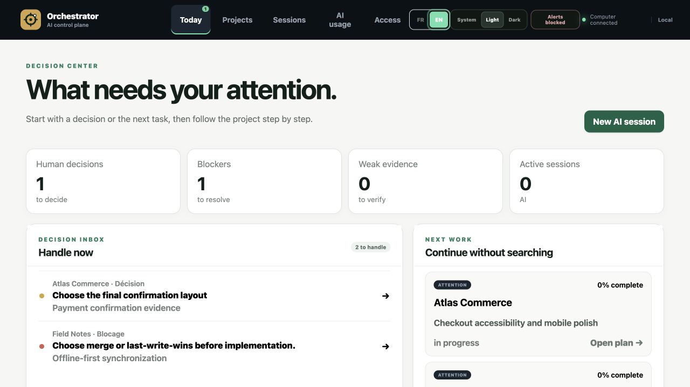
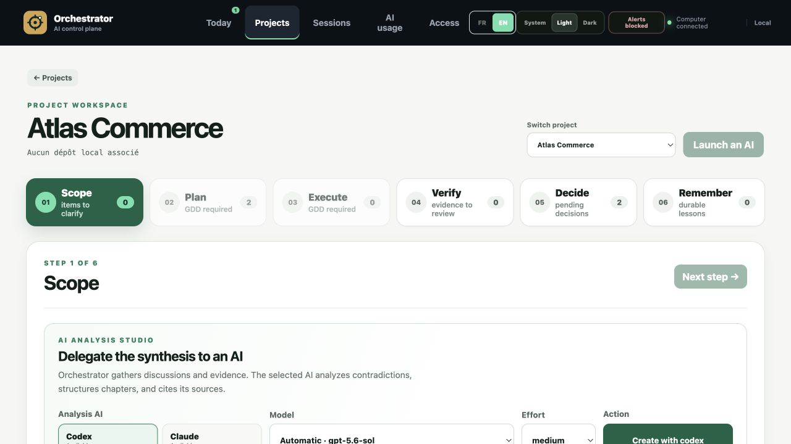
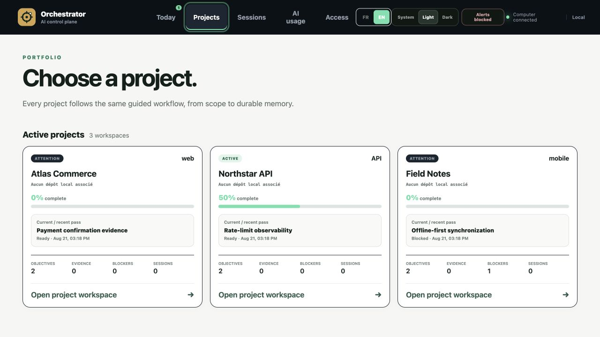

<p align="center"></p>

# Orchestrator

Orchestrator is a local-first control plane for coordinating AI-assisted projects. It keeps scope, plans, live sessions, evidence, human decisions, and durable memory in one interface so the next action is always visible.



## Product workflow

Every project follows the same persistent, deep-linkable path:

**Scope → Plan → Execute → Verify → Decide → Remember**

- **Scope** turns discussions and existing project context into approved requirements.
- **Plan** organizes objectives, dependencies, passes, and acceptance criteria.
- **Execute** launches observable AI sessions with project-scoped permissions.
- **Verify** groups proofs, images, files, and test results by objective and pass.
- **Decide** records explicit human approvals, refusals, and comments.
- **Remember** preserves decisions, lessons, and evidence for the next session or pilot rotation.



## Central pilot and delegated agents

The central pilot is a conversational **coordinator**. It can read the project context and explicitly linked evidence, explain what happened, give an opinion, request a decision, and dispatch the next bounded action. It remains operationally read-only: research, edits, tests, reviews, and execution run in specialized `researcher`, `reviewer`, or `executor` sub-sessions.

The cockpit presents the coordinator and its delegated sessions as a tree. Manual, semi-automatic, and automatic modes control how much human confirmation is required. Long-running pilots rotate into fresh coordinator sessions with a bounded inheritance of decisions, proofs, and context.

## Main capabilities

- Multiple AI providers with detected models, configurable effort, real usage data when available, quota resets, and optional provider fallback.
- A single session composer for text, pasted images, and multiple uploaded files.
- Scrollable live terminals, structured discussions, timestamps, resume, stop, browser notifications, and readable archived output.
- Project, pilot, and sub-agent permission profiles; full-machine access is never exposed remotely.
- Evidence previews and modals, current-message attachments, objective/pass filters, hashes, and persistent verdicts.
- Temporary revocable HTTPS access for phones and remote computers, with scoped pairing tokens and optional sleep prevention.
- Google Drive and Dropbox journal synchronization with progress, conflicts, and durable knowledge indexing.
- French and English interfaces, plus light, dark, and system themes.
- Import/export, migrations, append-only events, reconciliation, and deep URLs that survive refreshes.



## Architecture

```text
Vue 3 cockpit
  ├─ project workflow, decisions, evidence, sessions
  └─ xterm.js live terminals over WebSocket
                 │
Express API ─────┼─ pilot coordinator and delegated sessions
                 ├─ provider/model/usage detection
                 ├─ remote access and cloud synchronization
                 └─ SQLite event journal and durable projections
```

The runtime uses Node.js 20+, Express, SQLite through `better-sqlite3`, `node-pty`, WebSocket, Vue 3, TypeScript, Vite, and xterm.js.

## Installation

```bash
npm install -g @chaibialaa/orchestrator@beta
orchestrator migrate
orchestrator serve 4173
```

Open `http://127.0.0.1:4173`. By default the service binds to localhost and stores data in `~/.orchestrator/orchestrator.db`. Use `ORCHESTRATOR_DB=/absolute/path/orchestrator.db` to select another database.

### Repository development

```bash
npm install
npm --prefix web install
npm run build
npm test
npm start
```

Use `npm run dev` for the Vite development server. Production assets are built into `public/`.

## Data safety

- Events are append-only and projected into decisions, blockers, verdicts, costs, sessions, and evidence manifests.
- Migration is explicit and idempotent; back up the database before upgrading an older installation.
- Available local evidence is hashed with SHA-256. Large artifacts stay referenced rather than copied by default.
- Pairing credentials are scoped and revocable. Remote sessions cannot request the full-machine permission profile.
- Cloud sync exchanges journal state and reports conflicts instead of silently overwriting history.

Back up and migrate:

```bash
sqlite3 ~/.orchestrator/orchestrator.db \
  "VACUUM INTO '/absolute/path/orchestrator-backup.db'"
orchestrator migrate
```

## License

[PolyForm Noncommercial 1.0.0](LICENSE.md)
