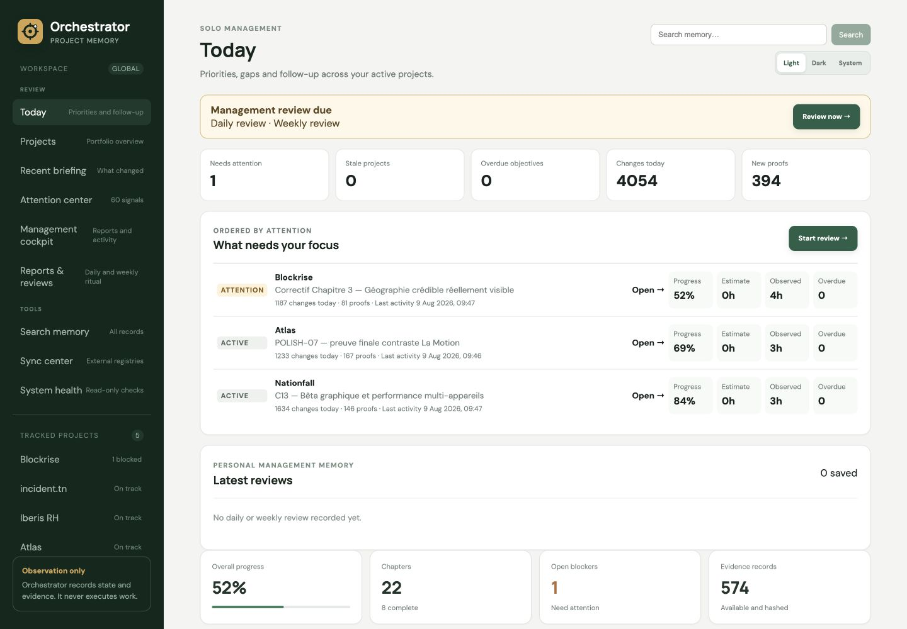
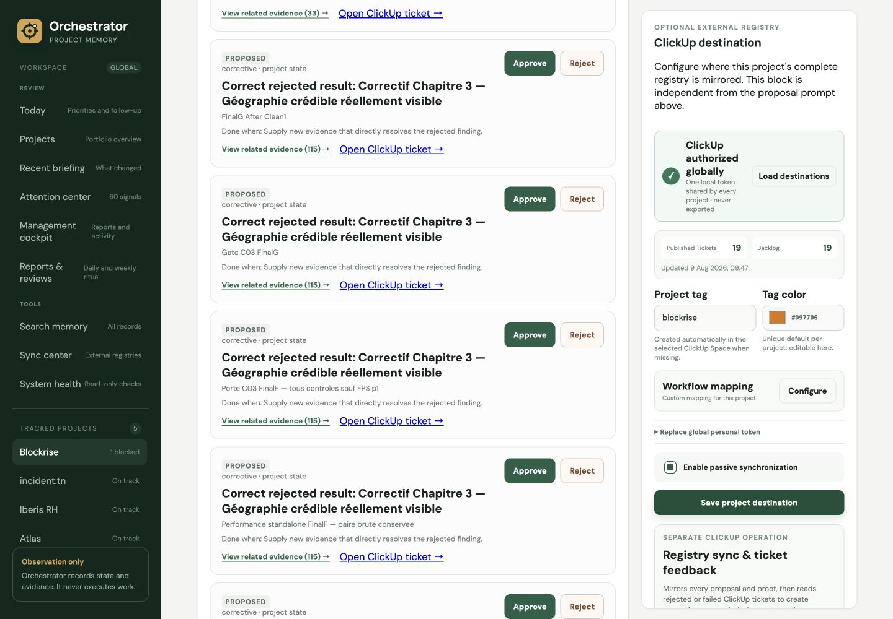

<p align="center"></p>

# Orchestrator

Orchestrator is an observation-only project dashboard and persistent memory for work performed by humans, Codex, Claude, and other tools outside Orchestrator.

It records projects, chapters, objectives, events, decisions, blockers, verdicts, costs, cleanup observations, Git snapshots, and evidence manifests. It does **not** start agents, execute commands, manage workers, control browsers, run Git, or automate project work.

## What it provides

- A global portfolio of tracked and locally detected projects.
- A global Attention Center for active decisions, blockers, evidence debt, and coordination risks.
- A recent global briefing grouped by project, with JSON and Markdown exports.
- A per-project summary of changes since the previous browser visit.
- Project chapters with derived progress, blockers, and history.
- A navigable dependency flow with completed, active, blocked, planned, retry, and return paths.
- An explainable confidence score based on evidence coverage, freshness, Git observations, blockers, judgments, and coordination conflicts.
- Universal search across projects, objectives, events, decisions, evidence labels, paths, hashes, and declared Git data.
- Portable, hashed project snapshots with local browser history and state comparison.
- Shareable deep links and saved views that restore the selected project, view, chapter, pass, and proof.
- Evidence grouped by chapter and pass, with image previews, full-screen navigation, text display, hashes, retention status, and local verification.
- A traceable event journal that separates measured facts, agent statements, human judgments, and system records.
- Human-judgment forms shown only when a judgment has explicitly been requested.
- Multi-machine coordination records for concurrent passes and observed Git state.
- Read-only discovery of local Codex and Claude memory.
- Project-scoped recovery of proof references from local Codex and Claude conversations, with provenance, timestamps, availability, size, and SHA-256 hashes.
- Human-reviewed planning proposals derived from local AI memory, blockers, failed verdicts, and project state.
- Optional passive ClickUp synchronization for the complete proposal registry, evidence attachments, rejected-ticket feedback, and project-specific workflow mapping.
- Portable JSON and Markdown exports, plus idempotent JSON import.
- Immutable journal synchronization through Google Drive or Dropbox.
- Token and cost analytics, including clearly labelled API-equivalent estimates from local session counters.
- Read-only system health for SQLite integrity, schema, WAL, backup inventory, and evidence debt.

## Dashboard

The interface organizes each project into four task-oriented paths: **Pilot** for state and next action, **Plan** for sequence and dependencies, **Verify** for chapters, passes and proofs, and **History** for memory, snapshots and usage. Context shortcuts connect the project summary directly to the current chapter, latest proof, plan and recovery history.



Each project can retain the recommended semantic ClickUp routing or map Orchestrator states to its own list workflow.



## Architecture

```text
External work (Codex / Claude / humans)
                 |
                 | events, states, evidence references
                 v
        Express ingestion and read API
                 |
                 v
      SQLite append-only event journal
                 |
                 +--> derived project state
                 +--> evidence manifests
                 +--> decisions / blockers / verdicts
                 +--> JSON / Markdown exports
                 |
                 v
          Vue 3 dashboard (read/record)
```

The runtime uses Node.js 20+, Express, SQLite through `better-sqlite3`, Vue 3, TypeScript, and Vite.

`events` is append-only: database triggers reject updates and deletions. Domain tables such as `decisions`, `blockers`, `verdicts`, `costs`, `cleanups`, and `evidence_manifests` are projections linked to their source event.

## Installation

```bash
npm install -g @chaibialaa/orchestrator@beta
orchestrator migrate
orchestrator serve 4173
```

Open `http://127.0.0.1:4173`. The server binds to localhost only.

For repository development:

```bash
npm install
npm --prefix web install
npm run build
npm test
npm start
```

The default database is `~/.orchestrator/orchestrator.db`. Override it with `ORCHESTRATOR_DB=/absolute/path/orchestrator.db`.

## AI workspace

The project-level **AI** view consolidates 41 passive capabilities for AI-assisted development. The first group covers work inbox, conversation handoff, Git freshness guard, evidence quality, failure intelligence, AI budget, decision queue, project pulse, context drift, agent SDK, session replay, definition-of-done contracts, proof expiry, impact map, branch comparison, prompt registry, model scorecard, risk register, release readiness, memory hygiene, and **What should I work on next?**.

The professional traceability group adds architecture decision records, dependency radar, test coverage mapping, regression watchlists, evidence comparison series, commit-to-objective traceability, requirement coverage, assumption register, technical-debt ledger, security evidence, performance baselines, environment matrix, ownership map, review coverage, independent-verification policy, knowledge gaps, release narrative, incident timelines, inferred project templates, and cross-project portfolio intelligence.

Every result is derived from recorded events and manifests. Recommendations never launch work, reserve files, modify Git, or contact an agent. Codex and Claude remain responsible for reading the handoff, verifying current Git state, doing the work externally, and reporting observations back.

```bash
orchestrator next
orchestrator handoff
orchestrator handoff --json
```

The same data is available through `GET /api/projects/:project/ai-workspace`, with portable handoffs at `GET /api/projects/:project/handoff.md` and `.json`.

## Engineering management cockpit

The global **Management cockpit** aggregates active projects across machines into a 30–365 day reporting window. It includes a GitHub-style activity calendar, recorded progress, blocker aging, evidence coverage, reported AI cost, latest Git state, and provenance by machine or agent. Metrics describe delivery flow and audit coverage; they are not individual productivity scores.

For solo multi-project management, **Today** orders projects by attention, exposes inactivity, pending decisions, daily changes, new proofs, the next recorded objective, and overdue work. Planning objectives can carry a due date and an estimate; Today and reports compare that estimate with time observed between reported `work.started` and `work.finished` events. The management cockpit adds a consolidated objective calendar, configurable inactivity/blocker/evidence/cost alerts, weekly targets, and a clearly qualified delivery forecast derived from recently completed objectives.

**Reports & reviews** provides a guided project/period/audience selector, live preview, personal context notes, reusable report templates, JSON and Markdown downloads, a native single-page PDF, and a print-ready HTML view. Any two archived snapshots can be compared. Daily and weekly reviews persist notes, follow-ups, project scope, and the report state used at review time.

`GET /api/management/today` returns the daily focus dataset. `GET /api/management/reminders` exposes daily-review, weekly-review, and scheduled-report due dates. `GET` and `PUT /api/management/settings` manage alert thresholds, weekly targets, and report templates. `POST /api/management/report/preview` and `/render/{json|markdown|html|pdf}` build scoped reports. `GET` and `POST /api/management/reviews` expose the append-only personal review history. `GET /api/management/reports/compare` compares the latest two archived reports, or explicit `before` and `after` report UIDs.

`GET /api/management` returns the portable dataset. `GET /api/management/report/json` and `/markdown` generate management reports. While the server is open, a portable snapshot is archived every 24 hours; tune this with `ORCHESTRATOR_REPORT_HOURS` and `ORCHESTRATOR_REPORT_DAYS`. Those immutable snapshots power period-over-period trend comparisons. `GET` and `POST /api/management/reports` list or capture snapshots. Commits are deduplicated from observed `post-commit` hashes, push attempts come from `pre-push`, and a verified push requires the passively read upstream tracking ref to equal local HEAD or an equivalent explicit provider event.

## Safe migration

Migration never runs automatically when the server starts. Back up the database first:

```bash
sqlite3 ~/.orchestrator/orchestrator.db \
  "VACUUM INTO '/absolute/path/orchestrator-backup.db'"
orchestrator migrate
```

The legacy migration is transactional and idempotent. It validates SQLite integrity and foreign keys, converts useful historical projects, objectives, passages, proofs, decisions, blockers, verdicts, and costs into the observation model, then removes obsolete execution tables. Do not migrate while an older Orchestrator process is still writing to the database.

## Data and provenance

Every event includes a project, kind, actor, occurrence time, summary, payload, and assertion type:

| Assertion | Meaning |
| --- | --- |
| `measured_fact` | Directly observed or measured result |
| `agent_statement` | Claim reported by Codex, Claude, or another client |
| `human_judgment` | Explicit human assessment |
| `system_record` | Imported or system-generated record |

Available local evidence requires a SHA-256 hash. Large artifacts remain referenced by absolute path or URL rather than being copied into the database by default.

## Ingestion API

`POST /api/ingest` requires an `Idempotency-Key` header. A request may contain one event or a batch of up to 100 events.

```bash
curl -X POST http://127.0.0.1:4173/api/ingest \
  -H 'Content-Type: application/json' \
  -H 'Idempotency-Key: blockrise-ui-proof-001' \
  -d '{
    "project": "blockrise",
    "objective": "chapter-3",
    "kind": "evidence.recorded",
    "actor_kind": "codex",
    "actor": "Codex",
    "assertion": "measured_fact",
    "summary": "Responsive dashboard verified",
    "occurred_at": "2026-08-06T13:00:00Z",
    "payload": {
      "label": "Dashboard screenshot",
      "type": "image",
      "origin": "browser verification",
      "locator_kind": "path",
      "path": "/absolute/path/dashboard.png",
      "sha256": "<sha256>",
      "bytes": 123456,
      "status": "available",
      "retention": "referenced",
      "pass_ref": "203"
    }
  }'
```

Accepted kinds include:

`event.recorded`, `project.updated`, `objective.updated`, `evidence.recorded`, `verdict.recorded`, `decision.recorded`, `blocker.opened`, `blocker.resolved`, `transition.recorded`, `cost.recorded`, `cleanup.observed`, `context.summary`, `work.started`, `work.heartbeat`, `work.finished`, `git.state`, `human_judgment.requested`, and `human_judgment.cancelled`.

Important read endpoints:

```text
GET /api/health
GET /api/system/health
GET /api/projects
GET /api/portfolio
GET /api/attention
GET /api/search?q=:query&limit=40
GET /api/projects/:slug
GET /api/projects/:slug/timeline
GET /api/projects/:slug/resume
GET /api/briefing
GET /api/briefing/export/json
GET /api/briefing/export/markdown
GET /api/projects/:slug/confidence
GET /api/projects/:slug/snapshot
POST /api/snapshots/compare
GET /api/projects/:slug/evidence
GET /api/projects/:slug/coordination
GET /api/projects/:slug/git-guard
GET|PUT /api/projects/:slug/profile
GET /api/projects/:slug/diagram
GET /api/evidence/:uid/verify
GET /api/analytics?project=:slug&days=30
GET /api/memory/local
POST /api/memory/local/index
GET /api/memory/local/index
GET /api/projects/:project/memory/recovery
POST /api/projects/:project/memory/recovery
GET /api/sync
GET /api/projects/:project/planning
POST /api/projects/:project/planning/generate
POST /api/projects/:project/planning/:proposal/review
PUT /api/projects/:project/planning/objectives/:objective/schedule
PUT /api/projects/:project/planning/order
POST /api/projects/:project/planning/dependencies
DELETE /api/projects/:project/planning/dependencies
PUT /api/projects/:project/clickup
POST /api/projects/:project/clickup/sync
GET /api/projects/:project/clickup/preview
POST /api/security/pair
GET /api/security/tokens
POST /api/security/tokens/:uid/revoke
```

There are no run, queue, claim, cancel, worker, agent-launch, process-control, or Git-execution routes.

## Per-project tracking commands

From a project repository, Codex, Claude, or a human can explicitly enable passive tracking:

```bash
orchestrator enable my-project --name "My Project"
orchestrator hooks install
orchestrator status
orchestrator record ./observation.json
orchestrator evidence add ./path/to/proof.png \
  --objective objective-uid \
  --pass pass-42 \
  --type render \
  --origin codex
orchestrator disable
```

`enable` creates a portable `.orchestrator.json` contract in the current repository and marks the project active in the local registry. `hooks install` adds reversible Git lifecycle hooks while preserving existing hook content. Git invokes them before commits and after commits, checkouts, merges, and rewrites; they only report the branch, commit, machine, and dirty state to a running local Orchestrator. Use `orchestrator hooks status` or `orchestrator hooks uninstall` to inspect or remove them.

The contract uses `evidence_mode: "declared-only"`: Orchestrator never treats an arbitrary repository file as proof. Its passive filesystem follower batches changed paths, excludes generated/cache-heavy directories, refreshes versioned plans, and records the local Git head as dirty after a change. It does not read file contents into evidence, run Git, execute tests, or start project processes. Explicit evidence still requires `evidence add`, which hashes and measures only the supplied file. `record` sends a declared cost, decision, blocker, transition, Git state, cleanup, or verdict. `disable` archives tracking, stops the follower on the next reconciliation, and rejects further ingestion without deleting history.

Git hooks observe `pre-commit`, `post-commit`, `pre-push`, checkout, merge and rewrite lifecycle events. A `pre-push` event is reported only as a **push attempt**; a successful push is counted only after an explicit remote/provider verification event.

Codex and Claude integrations should check `orchestrator status` before reporting work and use the ingestion API for events, transitions, Git observations, verdicts, decisions, blockers, cleanups, token usage, and costs. Reporting commands never start an agent, task, Git command, browser, or project process. The dashboard server owns only the passive repository follower; optional hooks are launched by Git and invoke only the reporting command.

Claude Code can install a project command or a user-wide slash command:

```bash
orchestrator integrate claude
orchestrator integrate claude --global
```

Restart Claude Code, then use `/orchestrator`. The command asks Claude to read the approved next objective and handoff, independently verify Git and feasibility, execute externally, and report proofs and transitions. A proposal awaiting human review never grants execution authority.

## Human judgment

A judgment form is derived from an active `human_judgment.requested` event. The reviewer only selects a verdict and writes the judgment; project, chapter, and objective context are already known by the interface. Proven objectives and cancelled requests never display a stale judgment form.

Standing human authorization recorded on 2026-08-06: after the requested verdict cycle is exhausted, an external agent may perform a local correction strictly bounded to the already identified defect without requesting another judgment first. This authorization does not cover a new product decision, external spending, push or publication, irreversible action, or material scope expansion. Those cases still require explicit authorization. Orchestrator only records this policy and the resulting observations; it never performs the correction.

Standing continuity rule recorded on 2026-08-06 for Nationfall, Blockrise, and Atlas: external work does not stop after a verdict, cleanup, report, closure, or lock release. The next safe step and any heavy-work slot transfer must already be started or handed off before the external thread reports completion. Exceptions are limited to an undocumented product decision, external spending, push or publication, irreversible action, or a blocker that cannot be corrected locally. Orchestrator stores this rule as passive memory only and never launches the next step itself.

External collaboration rule recorded on 2026-08-06: Claude is a coproductor for divisible missions, with a target of 40–50% of useful work assigned through an explicit scope and exclusive file ownership while Codex advances on a separate path. Codex retains integration, heavy tests, UI/browser validation, evidence, judgment, and cleanup. Only one Claude slot may be active across projects; an empty result, quota failure, or authentication error is diagnosed once and then reallocated without blocking. Analysis is timeboxed to 15 minutes and bounded implementation to 45 minutes. Orchestrator records this policy only and never launches either agent.

## Multi-machine coordination

External clients may report:

- `git.state`: machine, branch, head commit, and dirty state.
- `work.started`: session, machine, base commit, branch, and path scope.
- `work.heartbeat`: continued activity for a recorded session.
- `work.finished`: completed, failed, or cancelled outcome.

Orchestrator derives overlapping scopes, stale Git bases, and abandoned passes after 15 minutes without a finish or heartbeat. Planning also stores an explicit objective order and an acyclic prerequisite graph; next-work recommendations skip blocked objectives and objectives whose prerequisites are not proven. These are observations only: it does not reserve a worker, lock a repository, or run Git commands.

`GET /api/projects/:slug/git-guard` returns `current`, `dirty`, `divergent`, or `unknown` with a required external action. Agents call it before `work.started`, after reporting their local Git state. A divergent result means the external agent must fetch and reconcile Git itself; Orchestrator never performs or locks that operation.

## Local memory and cloud synchronization

`GET /api/memory/local` scans local Codex and Claude histories read-only through versioned adapters, groups sessions by working directory, and identifies projects that are not yet tracked. `POST /api/memory/local/index` stores only an auditable manifest (source, adapter version, sampled-content hash, parse status and error count); raw conversations remain in their original local files. Adding a detected project remains an explicit human action.

Google Drive and Dropbox synchronization exchange immutable, content-addressed journal shards named like:

```text
orchestrator-journal--<machine>--<cursor>--<hash>.json
```

Synchronization imports remote shards and publishes new local shards without deleting or overwriting history. OAuth credentials remain in `~/.orchestrator/oauth.json`; refresh tokens are encrypted in SQLite using `~/.orchestrator/secret.key`. Large evidence files are not uploaded by default.

If two machines publish different mutable planning fields for the same objective UID, the incoming record is preserved as an explicit sync conflict. The Sync center lets a human keep local state, accept incoming state, or ignore the divergence; neither side silently overwrites the other. `GET /api/sync/conflicts` exposes the queue. Objective dependencies are included in portable exports and machine journals.

Small local evidence files are synchronized with Drive or Dropbox by content hash. Before upload, PNG, JPEG, WebP, TIFF, and AVIF images are auto-oriented, limited to 1920 px, and encoded as WebP quality 82 when that produces a smaller file. The original stays local and remains the authoritative proof; the cloud record stores the original hash plus the derivative transport hash and both sizes. `ORCHESTRATOR_IMAGE_MAX_PX` and `ORCHESTRATOR_IMAGE_QUALITY` tune this behavior. GIF and non-image evidence remain unchanged. The default per-file limit is 50 MB and can be changed with `ORCHESTRATOR_EVIDENCE_CLOUD_MAX_MB`. Each sync uploads at most 100 files and 100 MB; tune these safeguards with `ORCHESTRATOR_EVIDENCE_CLOUD_BATCH_FILES` and `ORCHESTRATOR_EVIDENCE_CLOUD_BATCH_MB`. A sync indexes existing remote blobs, uploads only hashes that are absent, and never overwrites another version. Evidence above the limit remains referenced only.

## Planning proposals and ClickUp

The **Planning** view accepts a user need and turns it, or existing records, into deduplicated proposals for chapters, tasks, instructions, or bounded corrections. Sources are explicit: local Codex/Claude memory, current project state, failed verdicts, open blockers, a rejected ClickUp ticket, or a human. Generation is deterministic and local; Orchestrator does not call a model or launch an agent. Every proposal must be approved or rejected by a human before it can become an objective.

ClickUp is optional. OAuth or a personal token connects one ClickUp account globally to the local Orchestrator installation; the credential is stored once, never returned by the API, and never exported. Each project independently selects its Workspace, destination List, project tag, tag color, workflow mapping, and synchronization state. Tag colors receive stable distinct project defaults, remain editable, and update existing ClickUp Space tags during synchronization. For OAuth, create a ClickUp app once, register `http://127.0.0.1:4173/api/clickup/oauth/callback`, then set `CLICKUP_CLIENT_ID` and `CLICKUP_CLIENT_SECRET` (or override the callback with `CLICKUP_REDIRECT_URI`). The full proposal registry is synchronized: proposed work is tagged `orchestrator-backlog`, approved work `orchestrator-ready`, rejected work `orchestrator-rejected`, and superseded work accordingly. Orchestrator maps these states onto the destination list's real workflow statuses (for example Scoping, Ready for Development, Shipped, and Cancelled), using semantic defaults or a project-specific mapping configured from the Planning screen. Individual rows may remain on Recommended while others are overridden. Each ticket carries source, rationale, description, success criteria, proof manifests, hashes, remote proof URLs, and up to ten available local evidence files of 10 MB or less on first creation. Image attachments use the same smaller WebP transport derivative while the evidence description retains the authoritative original hash. Stable fingerprints update the same ticket rather than duplicating it. Remote rejected/refused/declined/failed tickets return as corrective proposals linked to the original.

While the server is running, a passive connector cycle synchronizes every enabled ClickUp project every five minutes. Set `ORCHESTRATOR_CLICKUP_SYNC_MINUTES` to another positive number, or `0` to disable scheduled synchronization. Projects are processed sequentially, overlapping cycles are rejected, and this connector only exchanges records and evidence; it never starts project work, an agent, Git, or a browser.

The global **Sync center** shows every connected project, configured label and List, live progress, the next scheduled cycle, the latest result, rate-limit or authentication failures, and an auditable run history. **Sync all projects now** provides a bounded manual retry. ClickUp 429 responses honor the provider reset window, and content hashes prevent unchanged tickets or attachments from being rewritten.

This is passive synchronization, not task execution. Orchestrator never assigns an agent, changes Git, starts work, or reacts continuously in the background. The ClickUp action is explicit, auditable, and safe to repeat.

On another machine, cloud-backed evidence appears as `cloud-only`. Use **Download evidence** to fetch it into `~/.orchestrator/evidence-cache`. Original files are restored and verified against the evidence hash. Optimized images are downloaded as explicitly labelled preview derivatives and verified against their transport hash; they never replace or impersonate the missing original proof. A failed hash check rejects the download, while the original manifest and event remain auditable.

## Import and export

```text
GET  /api/export/json?project=:slug
GET  /api/export/markdown?project=:slug
POST /api/import
```

JSON exports are complete logical bundles and can be reimported by UID without duplicating existing events. Markdown exports are readable handoff summaries. Referenced evidence metadata remains explicit about missing, external, or locally available bytes.

The CLI can export the complete journal:

```bash
orchestrator export
orchestrator export --markdown
```

## Token and cost analytics

External clients can include `input_tokens`, `output_tokens`, `cached_tokens`, `total_tokens`, `model`, `duration_ms`, `requests`, and `cost_basis` in `cost.recorded`.

For current local Codex and Claude sessions, Orchestrator reads local token counters and model names without contacting either provider. It can display a public API-equivalent estimate using a dated pricing table. This is **not** the actual cost of a subscription and is never presented as an invoice. Sessions opened at a parent directory remain machine-wide unless they can be reliably attributed to a project.

Each project also has a validation profile (`software`, `game`, `web`, `api`, `mobile`, `ai`, `infrastructure`, `documentation`, or `other`). Its editable definition-of-done criteria guide external agents and reviews; Orchestrator records them but never runs the checks.

## Register health

`GET /api/system/health` performs read-only SQLite integrity and foreign-key checks, reports the active database and WAL sizes, schema version, latest recorded event, evidence-manifest debt, and an inventory of adjacent database files whose names identify them as backups. The dashboard exposes the same information under **System health**.

This endpoint never repairs, vacuums, backs up, restores, hashes every evidence file, or starts a background job. Evidence bytes remain verified only through the explicit per-manifest verification endpoint.

## Backup and restore

Use SQLite's consistent backup operation for a live database:

```bash
sqlite3 ~/.orchestrator/orchestrator.db \
  "VACUUM INTO '/absolute/path/orchestrator-backup.db'"
```

Back up referenced evidence separately when its retention matters. To restore, stop the server, preserve the current database under another filename, place the backup at the configured path, and validate it:

```bash
sqlite3 orchestrator.db "PRAGMA integrity_check; PRAGMA foreign_key_check"
```

## Development and verification

```bash
npm run dev
npm run build
npm test
```

The test suite covers migration idempotence, append-only history, ingestion idempotency, evidence integrity, import/export round trips, immutable sync journals, multi-machine merge conflicts, cycle-safe objective prerequisites, planning order and review, archived management reports, credential redaction, analytics, the 41-capability AI workspace, portable handoffs, and the absence of execution capabilities in the published runtime.

## Security and limits

- Localhost remains passwordless for fast installation. Non-local API clients must use a scoped bearer token created once from localhost with `POST /api/security/pair`; tokens are stored hashed, shown once, individually auditable, and revocable. TLS is still required before exposing the service beyond a trusted private network.
- Local records trust the host machine that produced them.
- Evidence verification is on demand, not a background watcher.
- Cloud evidence synchronization is bounded; files above the configured limit remain hash-addressed references.
- Failed Drive/Dropbox cycles retain their cursor and expose exponential retry timing; successful cycles reset the failure state. Never place the live SQLite file itself in a synchronized folder.
- Cleanup records describe an observed state; they never delete resources.
- API-equivalent cost estimates depend on reported token categories and the dated local rate table.

## License

[PolyForm Noncommercial 1.0.0](LICENSE.md)
